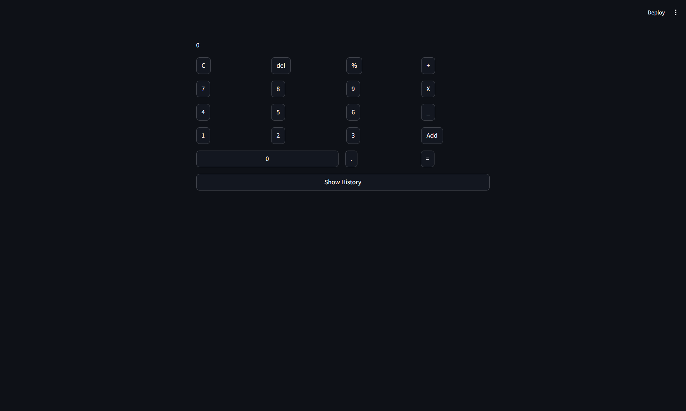
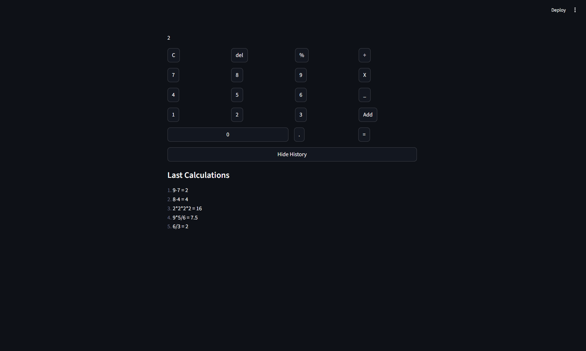

## Calculator Streamlit
this is a frontend practice task to for getting a feel of making frontend of project, the basic task of making a simple
calculator is done.

---
### tech stack used
- UI with streamlit
- python of evaluation

---
### things learned
- streamlit sessions
- streamlit buttons
- streamlit columns

---
### Screenshots
- UI of calculator

- All Features


---

### how to run
clone this repo in your virtual environment and run these commands in your terminal
- ```pip install streamlit```
- ```streamlit run practice/frontend/calculator.py```

make sure these commands are run in project root.

---